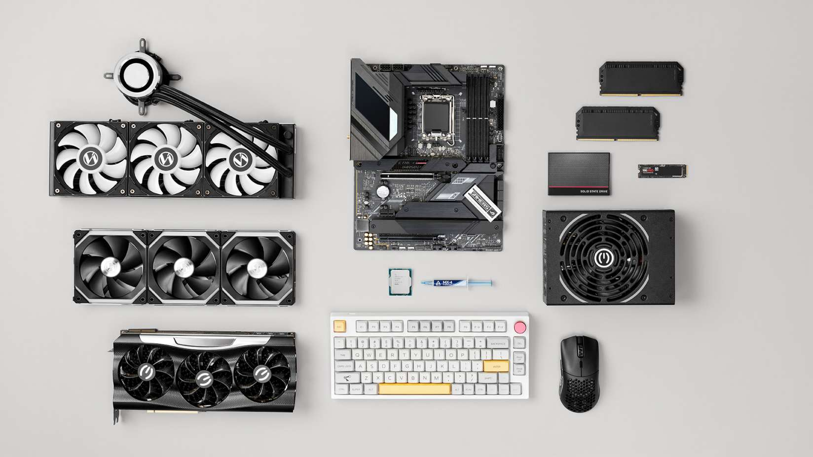
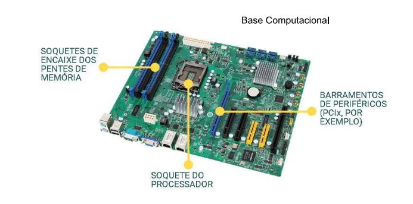

# _Montagem passo a passo de um computador desktop_
### by Alisson Miranda

---

## Assuntos da aula de hoje

* Conhecer os componentes principais (**_Revisão_**)
* Ferramentas úteis
---
## Componentes principais
  
A **_placa mãe_**, ela gerencia a interligação de todos os componentes do computador, ou seja, a placa mãe que faz todos os componentes, como processador, memória RAM, o armazenamento, conversar em entre si.

---

---
| Componentes | Função                                                                  |
|-------------|-------------------------------------------------------------------------|
| Placa Mãe   | Gerencia a interligação de todos os componentes do computador           |
| Memória RAM | Mem. Prin. Mem de processamento/execução no processador                 |
| CPU         | Recebe informações e executa sequencialmente (Medida em Hertz)          |
| GPU         | processar e calcular a renderização gráfica gerados pelo sistema |
| HDD         | Disco rígido - Hard Disk (magnético e escrito por cabeçote)             |
| SDD         | Disco de estado sólido - memória flash                                  |

---

### Diferença entre cabo de dados e cabo de alimentação