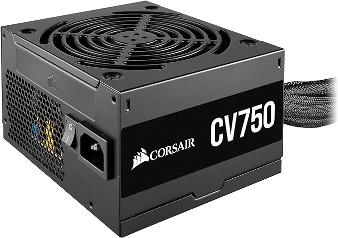
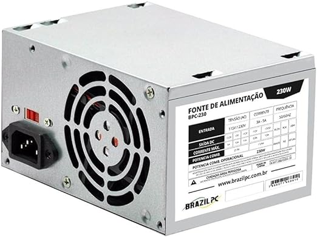
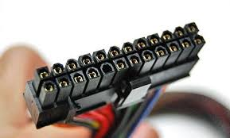

# Montagem de computador desktop

Aula prática passo a passo para montar um pc

##### by Alisson Miranda 

---
<!-- _class: topic -->

## Assuntos da aula de hoje

* Conhecer os componentes principais (**_Revisão_**)
* Ferramentas úteis

---

## Componentes principais

  
A **_placa mãe_**, ela gerencia a interligação de todos os componentes do computador, ou seja, a placa mãe que faz todos os componentes, como processador, memória RAM, o armazenamento, conversar em entre si, é um circuito impresso.

---

---
<!-- _class: invert-->
| Componentes | Função                                                                  |
|-------------|-------------------------------------------------------------------------|
| Placa Mãe   | Gerencia a interligação de todos os componentes do computador           |
| Memória RAM | Mem. Prin. Mem de processamento/execução no processador                 |
| CPU         | Recebe informações e executa sequencialmente (Medida em Hertz)          |
| GPU         | processar e calcular a renderização gráfica gerados pelo sistema |
| HDD         | Disco rígido - Hard Disk (magnético e escrito por cabeçote)             |
| SDD         | Disco de estado sólido - memória flash                                  |
| GABINETE         | Local para acomodar a placa mãe e tudo o que está incluso.                                  |
| Fonte de Alimentacao         | Responsável por mandar energia para a placa mãe (24 pinos).                                  |
---

### Fonte de alimentação

São importantíssimas para o bom funcionamento da placa mãe e todos os componentes conectados a ela, pois de acordo com o **_modelo_** e **_potencia_** contribuirá para a vida útil e assim evitar queimar a placa mãe e seus componentes.

| TIPO DE FONTE DE ALIMENTAÇÃO | SIGNIFICADO            | FUNÇÃO                                                                    |
|------------------------------|------------------------|---------------------------------------------------------------------------|
| PFC - Ativo                  | POWER FACTOR CORRETION | Troca automaticamente a tensão ideal da fonte para os compotenentes do PC |
| PFC - Passivo                | POWER FACTOR CORRETION | Troca de tensão MANUAL para os componentes do PC. (chave bivolt)          |
---

* Fonte PFC Ativo

---

* Fonte PFC Passivo

---

# Ferramentas úteis

1. Chave "Philips" (Indispensável)
2. Pasta Térmica (Indispensável)

---

# O que você precisa

1. Processador e placa mãe compatíveis
2. Cooler box de acordo com a placa mãe
3. Memória RAM
4. Placa de vídeo (Opcional se for o caso)
5. Armazenamento SSD ou HD
6. Fonte de Alimentação de boa qualidade (PFC Ativo e eficiência de energia)
7. Gabinete compatível com a placa mãe e peças (Tamanho)

---
<!-- _class: minha_class -->
# Passo a passo 1º Etapa

- [ ] checar todas as peças
* [ ] posicionar placa mãe em local plano e seguro
* [ ] Instalar o processador na placa mãe observando a posição correta
* [ ] Instalar a memória RAM no slot correto
* [ ] colocar pasta térmica no processador
* [ ] inserir o cooler sobre o processador e **parafusar** em diagonal
* [ ] Ligar o cooler na placa mãe (CPU FAN)

---

# Passo a passo 2º Etapa

- [ ] Inserir o espelho da placa mãe no Gabinete
* [ ] Encaixar a placa mãe no gabinte corretamente alinhando ao espelho e parafusá-la
* [ ] Inserir a fonte com a ventoinha para baixo no local correto e parafusar em diagonal
* [ ] Inserir o SSD/HD com a conexão sata e alimentação para frente
* [ ] O cabo de 24 pinos será conectado na placa mãe
* [ ] Os cabos satas são para o armazenamento seja HD, SSD ou gravadora
* [ ] O cabos de 8 pinos são para a placa de vídeo caso precise
* [ ] O cabo 4/8 pino é para processador
* [ ] Cabo molex fornece energia para as fans

---

## Fonte de 24 pinos

