# Montagem de computador desktop

Aula prática passo a passo para montar um pc

##### by Alisson Miranda, Eduardo Sousa and Kawã Moises 

---

<!-- _class: topic -->

## Assuntos da aula de hoje

* Conhecer os cabos e conexões
* Ferramentas úteis
* Montagem na prática

---

## Componentes principais

  
A **_placa mãe_**, ela gerencia a interligação de todos os componentes do computador, ou seja, a placa mãe que faz todos os componentes, como processador, memória RAM, o armazenamento, conversar em entre si, é um circuito impresso.

---
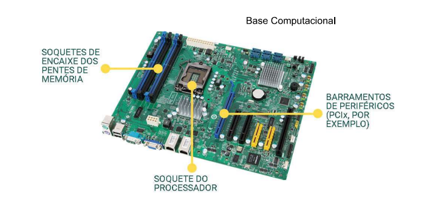

---
<!-- _class: topic-->

| Componentes | Função                                                                  |
|-------------|-------------------------------------------------------------------------|
| Placa Mãe   | Gerencia a interligação de todos os componentes do computador           |
| Memória RAM | Mem. Prin. Mem de processamento/execução no processador                 |
| CPU         | Recebe informações e executa sequencialmente (Medida em Hertz)          |
| GPU         | processar e calcular a renderização gráfica gerados pelo sistema |
| HDD         | Disco rígido - Hard Disk (magnético e escrito por cabeçote)             |
| SDD         | Disco de estado sólido - memória flash                                  |
| GABINETE         | Local para acomodar a placa mãe e tudo o que está incluso.                                  |
| Fonte de Alimentacao         | Responsável por mandar energia para a placa mãe (24 pinos).                                  |
---

<!-- _class: topo-->
# Conexões
## Soquete do processador
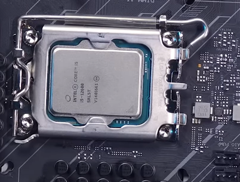
São “os encaixes” que as placas-mãe possuem para instalação dos processadores.

---

<!-- _class: topo2-->
# Conexões
## Cooler
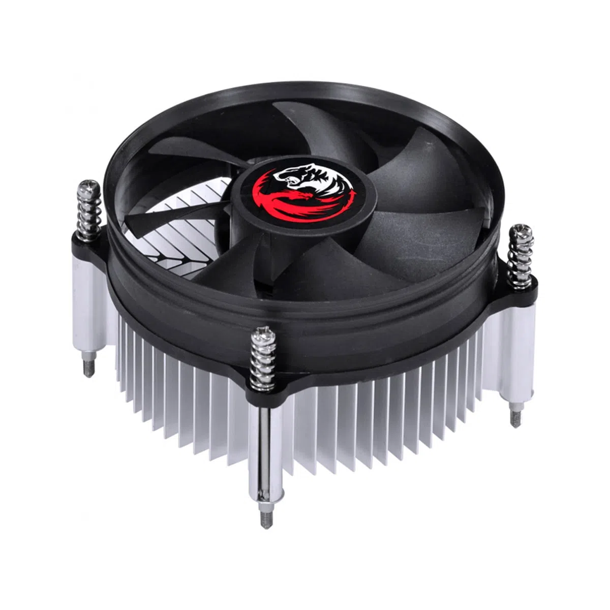
Coolers, que você também pode chamar de fans ou de ventoinhas, são necessários em computadores para aumentar a circulação de ar de forma a melhorar a capacidade do equipamento em dissipar calor no ambiente. Controlar o calor é fundamental para boa performance, vida útil prolongada e até mesmo manter consumo de energia sob controle.

---
<!-- _class: topo-->
# Conexões
## Cabo de 24 pinos
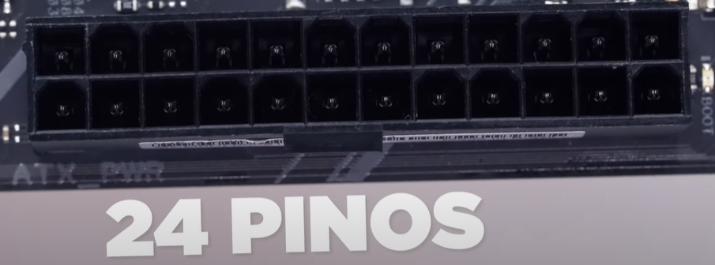
Cabo de alimentação de 24 pinos sua função é fornecer energia para toda a placa mãe.

---
<!-- _class: topo-->
# Conexões
## IPS 12v ou ATX

Cabo de alimentação para fornecer energia para o cooler e processador (energia a mais). 

---
<!-- _class: topo-->
# Conexões
## PWM
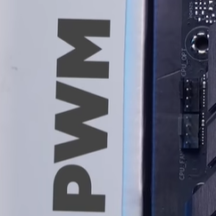
Sua função é alimentar as ventoinhas, possui normalmente 4 pinos e ficam próximas do processdor. 

---
<!-- _class: topo-->
# Conexões
## Conector sata
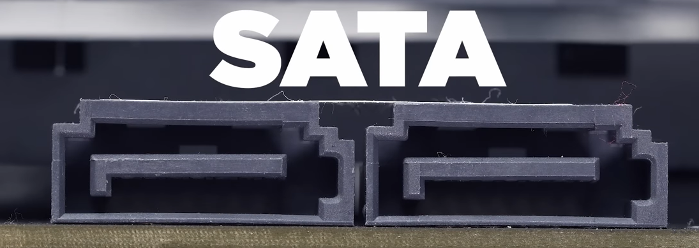
Conectores para dados para ligar hd, ssd e gravadora de dvd

---

<!-- _class: topo-->
# Conexões
## conexão frontal 2.0
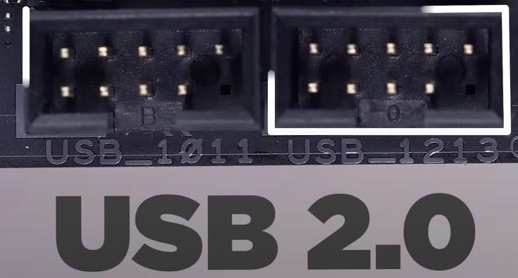
Conexão para alimentar dados usb 2.0 de 9 pinos

---

<!-- _class: topo-->
# Conexões
## PCI Express x16
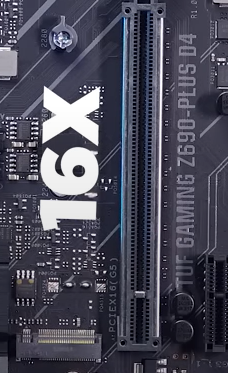
Um padrão que permite que diversos tipos de dispositivos, como placas de vídeo, sejam conectados a um computador

---

<!-- _class: topo-->
# Conexões
## Slot memória RAM

Slot memória memória RAM, há variações de acordo com o tipo, podem ser: DDR2(antigo), DDR3, DDR4 e DDR5. Nome técnico: **DIMM**: _Dual inline memory module_. DIMMs são módulos de memória para sistemas de desktop.

---

<!-- _class: topo-->
# Conexões
## Frontal
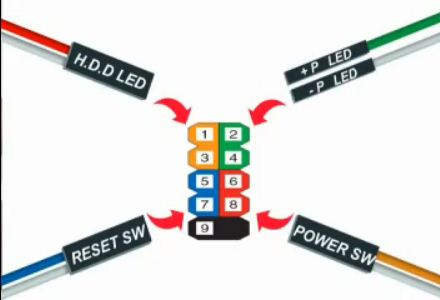
Serve para ligar o botão de liga/desliga, ubs frontais, botão de reset

---

### Fonte de alimentação

São importantíssimas para o bom funcionamento da placa mãe e todos os componentes conectados a ela, pois de acordo com o **_modelo_** e **_potencia_** contribuirá para a vida útil e assim evitar queimar a placa mãe e seus componentes.

| TIPO DE FONTE DE ALIMENTAÇÃO | SIGNIFICADO            | FUNÇÃO                                                                    |
|------------------------------|------------------------|---------------------------------------------------------------------------|
| PFC - Ativo                  | POWER FACTOR CORRETION | Troca automaticamente a tensão ideal da fonte para os compotenentes do PC |
| PFC - Passivo                | POWER FACTOR CORRETION | Troca de tensão MANUAL para os componentes do PC. (chave bivolt)          |
---

* Fonte PFC Ativo
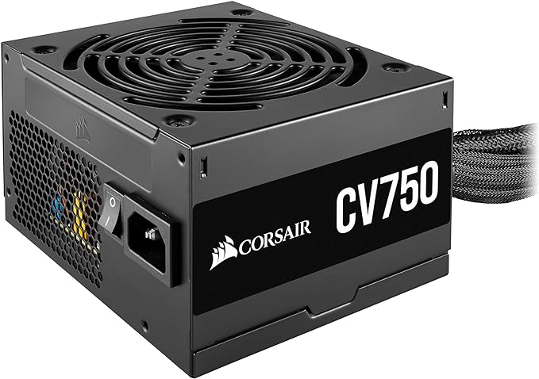

---

* Fonte PFC Passivo
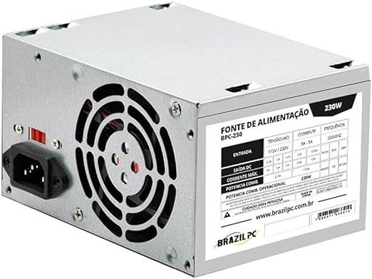

---

# Ferramentas úteis

1. Chave "Philips" (Indispensável)
2. Pasta Térmica (Indispensável)

---

# O que você precisa

1. Processador e placa mãe compatíveis
2. Cooler box de acordo com a placa mãe
3. Memória RAM
4. Placa de vídeo (Opcional se for o caso)
5. Armazenamento SSD ou HD
6. Fonte de Alimentação de boa qualidade (PFC Ativo e eficiência de energia)
7. Gabinete compatível com a placa mãe e peças (Tamanho)
